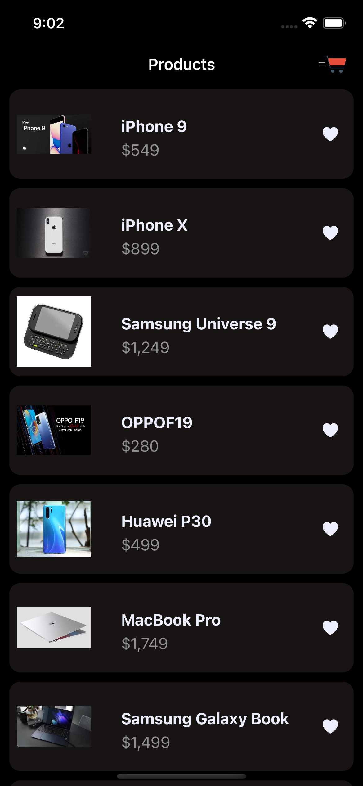
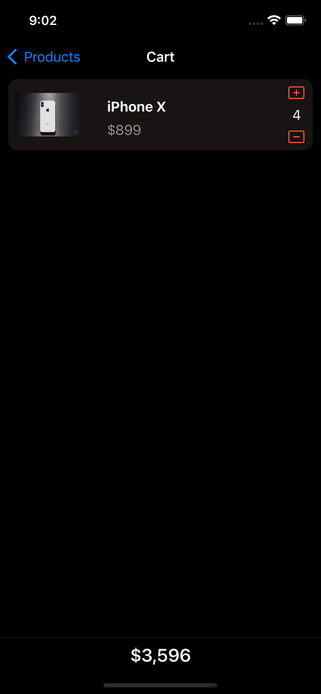
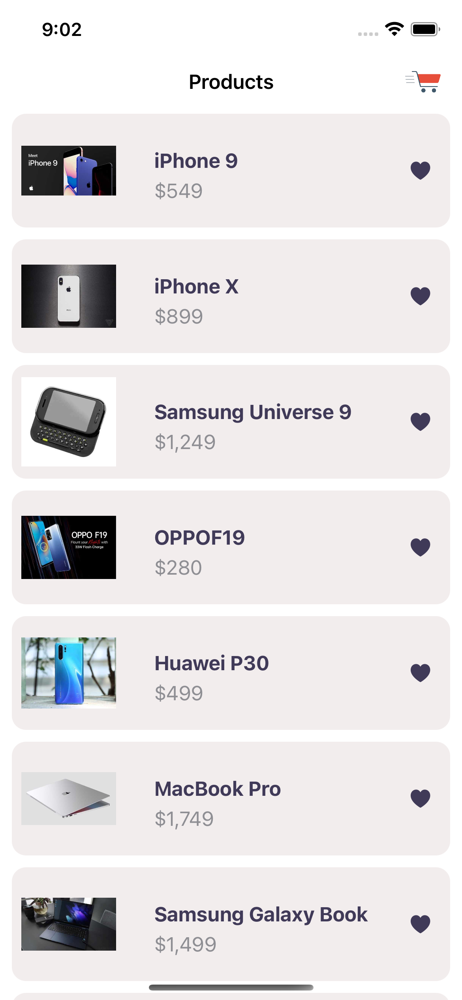
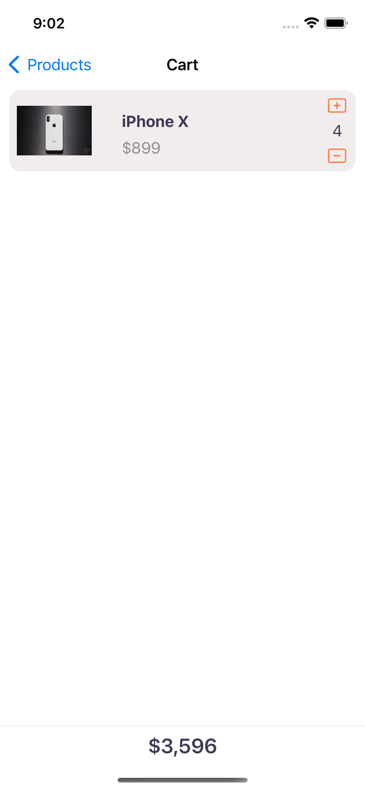

# LocalShop
A simple shopping app

## Overview

This project is build in SwiftUI. It shows a list of products. When you click like icon on a product, that product gets added to the cart list. You can see the list of products in the cart by clicking on the cart icon on the top right corner of the screen.

## What is featured

- The project follows the MVVM pattern.
- It is separated into 4 layers:
    - The `APIClient` layer is used for fetching data of products
    - The `Data` layer uses a repository to get the data from APIClient or storing/restoring data from `CoreData`
    - The `Domain` layer that has entities, mainly the `Product` enrity.
    - The `Presentation` layer which has the `ViewModel` and `Views` of the `Products` and `Cart` list.
- It has error handling where the app will show an alert if there is an issue with loading products.
- Unit tests, there are unit tests for APIClient, Repository, PriceFormatter.
- For images, they are fetched and cahced with `Kingfisher`.
- Using async/await to fetch products and @MainActor to return products in the main thread
- The cart products are available offline.
- Support dark and light mode.

## What to improve
- Adding more tests, specifically ViewModel tests and perhaps `Snapshot` tests of screen
- UI Design could be better
- Adding `Pagination`
- Improve logic to show products offline

### Screenshots

| | |

| | |
